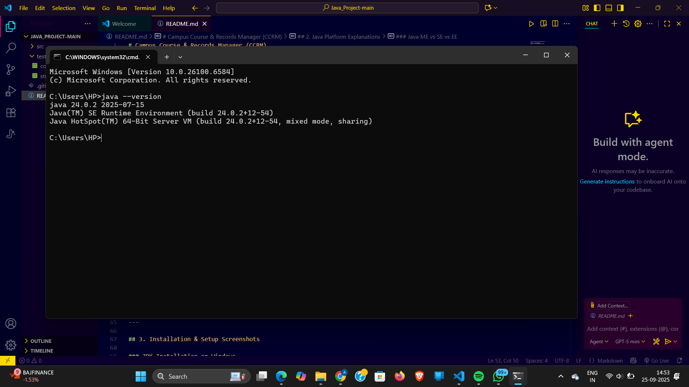
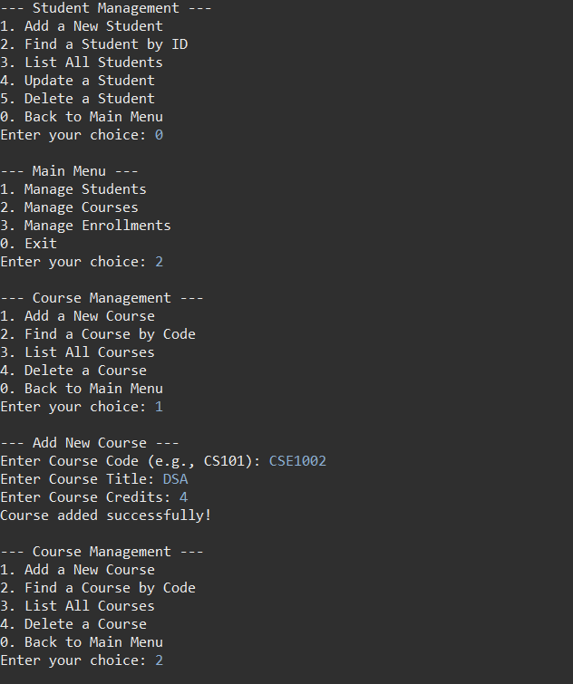
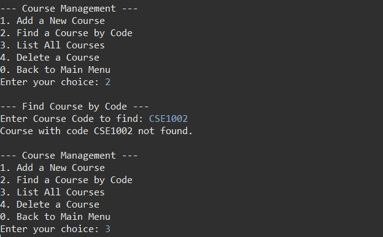
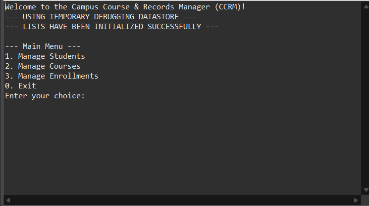
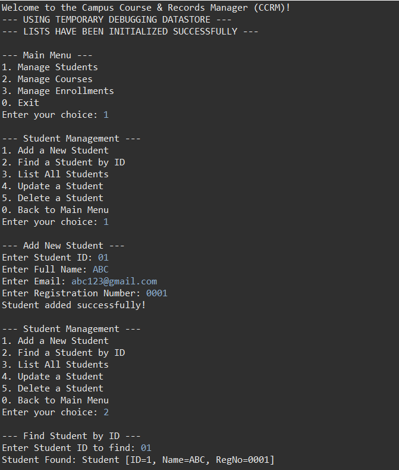
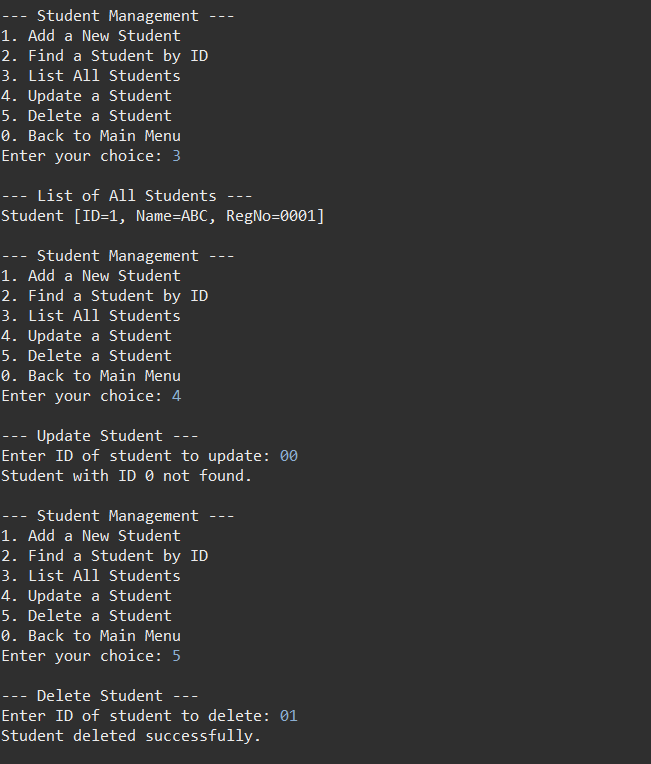

# Campus Course & Records Manager (CCRM)

**Author:** [SHAMBHAVI SINGH]
**Project for:** [Programming in JAVA ]

---

## 1. Project Overview & How to Run

The Campus Course & Records Manager (CCRM) is a console-based Java application designed to manage students, courses, and enrollments for an educational institute. It demonstrates core Java principles including Object-Oriented Programming (OOP), modern file I/O with NIO.2, the Stream API, and various design patterns.

### How to Run
1.  **Prerequisites:**
    * Java Development Kit (JDK) 17 or newer.
    * Git.
2.  **Clone the Repository:**
    ```bash
    git clone [https://github.com/AnshikaModi/java.git]
    ```
3.  **Navigate to the Project Directory:**
    ```bash
    cd ccrm-java-project
    ```
4.  **Compile and Run (from root folder):**
    ```bash
    # Compile all .java files from the src directory into the bin directory
    javac -d bin src/edu/ccrm/*/*.java

    # Run the main class from the bin directory
    java -cp bin edu.ccrm.cli.Main
    ```

---

## 2. Java Platform Explanations

### Evolution of Java (Short Timeline)
* **1995:** Java 1.0 is publicly released by Sun Microsystems. "Write Once, Run Anywhere."
* **1998:** Java 2 (J2SE 1.2) is released, introducing the Swing GUI toolkit and Collections framework.
* **2004:** Java 5 (J2SE 5.0) introduces major language features like Generics, Enums, Annotations, and the `for-each` loop.
* **2011:** Oracle acquires Sun. Java 7 is released.
* **2014:** Java 8 is released, a landmark version introducing Lambda Expressions, the Stream API, and a new Date/Time API.
* **2017:** Java moves to a faster 6-month release cycle starting with Java 9.
* **2018:** Java 11 is released as a new Long-Term Support (LTS) version.
* **2021:** Java 17 is released as the latest LTS version.

### Java ME vs SE vs EE

| Feature           | Java ME (Micro Edition)                             | Java SE (Standard Edition)                            | Java EE (Enterprise Edition)                             |
| ----------------- | --------------------------------------------------- | ----------------------------------------------------- | -------------------------------------------------------- |
| **Target** | Resource-constrained devices (e.g., old mobile phones, IoT) | Desktop, servers, standard computing environments   | Large-scale, distributed enterprise applications       |
| **Core API** | A small subset of the Java SE API                   | The core Java language and platform API               | Extends Java SE with APIs for enterprise features      |
| **Key Features** | Small memory footprint, specific profiles (MIDP)    | JVM, JDK, JRE, Collections, Swing, I/O, Networking    | Servlets, JSP, EJB, JPA, Web Services (SOAP/REST)      |
| **Use Case** | Embedded systems, old mobile apps.                  | This CCRM project, desktop apps, Android development. | Web servers, application servers, complex business systems. |

### JDK vs JRE vs JVM

* **JVM (Java Virtual Machine):** The JVM is an abstract machine that provides the runtime environment in which Java bytecode can be executed. It's the component that allows Java to be "platform-independent." It doesn't know anything about the Java source code; it only runs the compiled `.class` files.
* **JRE (Java Runtime Environment):** The JRE is the implementation of the JVM. It provides the minimum requirements for executing a Java application. It includes the JVM, core libraries, and other components. You need the JRE to *run* Java programs.
* **JDK (Java Development Kit):** The JDK is the full-featured software development kit for Java. It includes everything the JRE has, plus the tools needed to *develop* Java applications, most importantly the **compiler** (`javac`). You need the JDK to *write and compile* Java programs.

**Interaction:** `JDK` contains `JRE`, which in turn contains `JVM`.
`Developer -> writes .java code -> uses JDK (compiler) -> creates .class bytecode -> JRE (on user's machine) -> runs bytecode on JVM`

---

## 3. Installation & Setup Screenshots

### JDK Installation on Windows

![JDK Version]



### Eclipse Project Setup

![Eclipse Project Setup]


---

## 4. Syllabus Topic Mapping Table

This table maps the required technical concepts to where they are demonstrated in the source code.


| Syllabus Topic                      | File / Class / Method Location                                      |
| ----------------------------------- | ------------------------------------------------------------------- |
| **Core Java & Syntax** |                                                                     |
| Packages                            | `edu.ccrm.*` package structure                                      |
| `main` class & entry point          | `edu.ccrm.cli.Main.java`                                            |
| Primitive variables & Operators     | Used throughout all methods (e.g., `int id`, `if (choice == 1)`)      |
| Decision Structures (if, switch)    | `edu.ccrm.cli.Main.java` (in menu loops)                              |
| Loop Structures (while, for-each)   | `edu.ccrm.cli.Main.java` (main loop), `listAllStudents` (forEach)     |
| Arrays & Strings                    | `FileServiceImpl.java` -> `line.split(",")`                         |
| **Object-Oriented Programming** |                                                                     |
| Encapsulation (private fields)      | All classes in `edu.ccrm.domain` (e.g., `Student.java`)               |
| Inheritance (`extends`)             | `Student.java` extends `Person.java`                                |
| Abstraction (abstract class)        | `Person.java` is an abstract class                                  |
| Polymorphism (virtual methods)      | `student.toString()` is called in `listAllStudents`                 |
| Interfaces (`implements`)           | `StudentServiceImpl.java` implements `StudentService.java`          |
| Enums (with fields & constructor)   | `edu.ccrm.domain.Grade.java`                                        |
| **Advanced Concepts** |                                                                     |
| Design Pattern: **Singleton** | `edu.ccrm.service.DataStore.java`                                   |
| Design Pattern: **Builder** | `edu.ccrm.domain.Course.java` (inner `Builder` class)               |
| Exception Handling (`try-catch`)    | `FileServiceImpl.java` (parsing), `Main.java` (user input)        |
| File I/O (NIO.2)                    | `edu.ccrm.io.FileServiceImpl.java` -> `Files.lines(path)`           |
| Date/Time API                       | `edu.ccrm.domain.Enrollment.java` -> `LocalDate.now()`              |
| Lambdas & Functional Interfaces     | `listAllStudents` -> `students.forEach(System.out::println)`        |
| Java Stream API                     | `FileServiceImpl.java` -> `.stream().skip(1).map(...)`              |
| **(Features to be added)** |                                                                     |
| Custom Exceptions                   | *(To be added in Enrollment business rules)* |
| Recursion                           | *(To be added in Backup size calculation)* |

---

## Output







### Enabling Assertions
Assertions are disabled by default. To run the program with assertions enabled, use the `-ea` (enable assertions) flag:
```bash
java -ea -cp bin edu.ccrm.cli.Main
